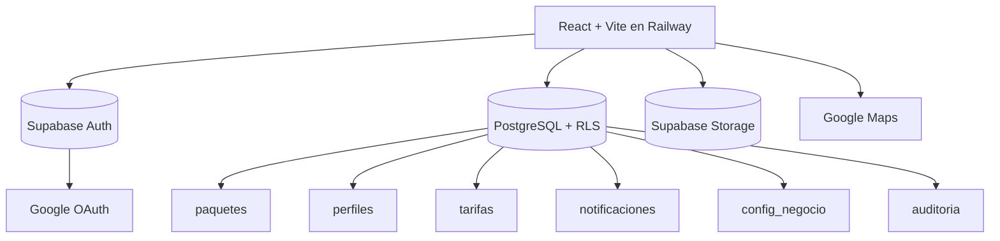

# Los Líderes Encomiendas 📦
> App multi-rol para gestión de encomiendas puerta a puerta, de Maicao (Colombia) a Maracaibo (Venezuela)


## Descripción

Los Líderes Encomiendas digitaliza el negocio de encomiendas de Los Líderes: los paquetes que los clientes compran en tiendas online (Amazon, Shein, Temu) llegan a una bodega en Maicao, se registran con foto y medidas, se les asigna un precio, y se entregan a domicilio en Maracaibo.

Es una sola aplicación web con **cuatro experiencias según el rol** del usuario (cliente, bodeguero, administración y conductor), pensada mobile-first para usarse con una sola mano desde el celular.

## App en producción

**https://loslideres-app-production.up.railway.app**

## Stack tecnológico

- **Frontend**: React 19 + Vite 8 + Tailwind CSS 4 — desplegado en Railway
- **Backend (BaaS)**: Supabase — PostgreSQL + Auth + Storage + Row Level Security
- **Estado**: Zustand (sesión) + TanStack Query (datos del servidor)
- **Formularios**: React Hook Form + Zod
- **Auth**: Supabase Auth (Email/Password + Google OAuth)
- **Storage**: Supabase Storage (fotos de paquetes, comprimidas a ≤300 KB)
- **Iconos**: Lucide React
- **CI/CD**: GitHub + Railway (deploy automático en cada push a main)
- **Versionado**: standard-version + Conventional Commits + build number automático

## Roles y flujo

| Rol | Qué hace |
|-----|----------|
| **Cliente** | Ve su código de casillero (LID-XXXX), la dirección de la bodega, y el estado + precio de cada paquete. Recibe notificaciones en cada cambio. |
| **Bodeguero** | Registra los paquetes que llegan a Maicao: foto (cámara o galería), medidas, peso, y los asigna a un casillero. Ve su reporte de recepciones y comisión. |
| **Administración** | Asigna precio a cada paquete, elige conductor y monto de traslado, gestiona usuarios y tarifas, marca entregas. |
| **Conductor** | Ve los paquetes asignados con mapa y navegación, inicia el reparto, y marca la entrega registrando quién recibió y el pago. Ve su reporte de entregas. |

Un mismo usuario puede tener varios roles (por ejemplo, un administrador también puede actuar como conductor).

### Estados de un paquete

```
RECIBIDO → TARIFADO → EN_TRANSITO → EN_REPARTO → ENTREGADO
```

1. **RECIBIDO** — el bodeguero lo registra en Maicao
2. **TARIFADO** — administración le asigna precio y conductor
3. **EN_TRANSITO** — despachado hacia Maracaibo
4. **EN_REPARTO** — el conductor lo lleva al domicilio
5. **ENTREGADO** — entregado y pagado (fecha automática)

## Estructura del repositorio

```
loslideres-app/
├── frontend/                    # React + Vite
│   ├── public/                  # version.json (generado), logo-full.png
│   ├── src/
│   │   ├── assets/              # logo.png, logo-mini.png, logo-full.png
│   │   ├── components/
│   │   │   ├── layout/         # AdminLayout, BodegueroLayout, ConductorLayout
│   │   │   └── ui/             # Modal, Toast, EstadoBadge, NotifBell
│   │   ├── constants/          # roles, estados, tamaños, métodos de pago
│   │   ├── hooks/              # usePaquetes, usePerfiles, useTarifas, useConfig,
│   │   │                       #   useNotificaciones, useReportes, useVersion
│   │   ├── lib/                # supabase.js, notificar.js, imageUtils.js
│   │   ├── pages/
│   │   │   ├── auth/           # Login, AuthCallback, Onboarding, ForgotPassword
│   │   │   ├── cliente/        # Casillero, PaquetesCliente, DetallePaquete, Perfil
│   │   │   ├── bodeguero/      # Recepcion, Registros, ReporteBodeguero
│   │   │   ├── conductor/      # Entregas, ReporteConductor
│   │   │   └── admin/          # Dashboard, PaquetesAdmin, Tarifas, Usuarios
│   │   ├── store/             # authStore (Zustand)
│   │   ├── App.jsx            # Rutas y guards por rol
│   │   └── main.jsx           # Entry point + splash
│   ├── gen-version.js         # Genera version.json (versión + build + commit)
│   ├── nixpacks.toml          # Config de build de Railway
│   ├── railway.json           # Config de deploy de Railway
│   ├── .versionrc.json        # Config del changelog
│   └── package.json
├── CHANGELOG.md
└── README.md
```

## Funcionalidades

| Módulo | Feature | Versión |
|--------|---------|---------|
| Auth | Login Email/Password y Google OAuth, con redirección por rol | v0.0.1 |
| Auth | Registro de cliente + onboarding obligatorio (tour + perfil + código LID) | v0.0.1 |
| Cliente | Casillero con código LID y dirección de bodega copiable | v0.0.1 |
| Cliente | Mis paquetes — lista con filtros por estado y timeline de seguimiento | v0.0.1 |
| Bodeguero | Recepción de paquetes con foto (cámara/galería), medidas y peso | v0.0.1 |
| Bodeguero | Compresión automática de fotos a ≤300 KB antes de subir | v0.0.1 |
| Bodeguero | Sugerencia automática de tamaño (S/M/L/XL) según las medidas | v0.0.1 |
| Admin | Dashboard con KPIs clickeables | v0.0.1 |
| Admin | Tarifación de paquetes con precio sugerido editable | v0.0.1 |
| Admin | Gestión de usuarios (crear cliente/bodeguero/conductor/admin) | v0.0.1 |
| Infra | Deploy en Railway + dominio público con HTTPS | v0.2.1 |
| Infra | Versionado semántico + changelog automático (standard-version) | v0.2.1 |
| Branding | Logo completo en login y splash screen con animación | v0.2.1 |
| Admin | Tarifas por tamaño editables en lote + pago configurable al bodeguero | v0.2.1 |
| UX | Modo claro forzado (evita inversión de dark mode en Samsung Internet) | v0.2.1 |
| Conductor | Módulo de entregas con mapa embebido y navegación a Google Maps | v0.3.0 |
| Conductor | Iniciar reparto y marcar entregado (receptor, método de pago, monto) | v0.3.0 |
| Admin | Asignación de conductor al tarifar (auto-asignación al admin si no elige) | v0.3.0 |
| Admin | Marcar entregado directamente desde el panel | v0.3.0 |
| Notificaciones | Campanita in-app con contador, por rol y evento | v0.3.0 |
| Reportes | Reporte de conductor (entregas + traslados) con filtro de fechas | v0.3.0 |
| Reportes | Reporte de bodeguero (recepciones + comisión) con filtro de fechas | v0.3.0 |
| Admin | Modal de detalle de usuario (avatar, roles, contacto, dirección) | v0.3.0 |
| Infra | Versionado con build number automático visible en el login | v0.3.1 |

## Notificaciones in-app

Campanita con contador de no leídas en el header, panel deslizable, y refresco cada 20 segundos. Los eventos se disparan automáticamente:

| Evento | Se notifica a |
|--------|---------------|
| Paquete recibido en bodega | Cliente + administradores |
| Paquete tarifado | Cliente + conductor asignado |
| Paquete despachado / en reparto | Cliente |
| Paquete entregado | Cliente + administradores |
| Nuevo usuario registrado | Administradores |

> **Nota**: por ahora son notificaciones dentro de la app (no push al teléfono con la app cerrada). El push real requiere PWA instalable + service worker, planeado para una versión futura.

## Modelo de precios

- **Tarifa al cliente por tamaño** (USD), editable desde el panel de admin: S, M, L, XL. Al tarifar, el sistema sugiere el precio según el tamaño pero el admin puede ajustarlo.
- **Pago al bodeguero** (COP), configurable: un monto fijo por cada paquete que registra. Se refleja en su reporte. Vive en la tabla `config_negocio`, editable sin redesplegar.

## Setup local

```bash
git clone https://github.com/loslideres-dev/loslideres-app
cd loslideres-app/frontend

# Instalar dependencias
npm install

# Configurar variables de entorno
cp .env.example .env
# Edita .env con tus credenciales de Supabase

# Arrancar en desarrollo (genera version.json automáticamente)
npm run dev
```

La app corre en `http://localhost:5173`. Para probar desde el celular en la misma red, usa la URL `Network` que muestra Vite.

### Variables de entorno

```env
VITE_SUPABASE_URL=https://tuproyecto.supabase.co
VITE_SUPABASE_ANON_KEY=tu_anon_key
VITE_APP_VERSION=0.3.1
VITE_APP_NAME=Los Líderes Encomiendas
```

## Versionado

Este proyecto usa [Conventional Commits](https://www.conventionalcommits.org/) y [standard-version](https://github.com/conventional-changelog/standard-version).

```bash
npm run release          # sube versión según los commits + regenera version.json
npm run release:minor    # fuerza minor
npm run release:major    # fuerza major
```

El número de **build** se genera automáticamente en cada `dev`/`build` a partir de la cantidad de commits en git, y se muestra en el login junto a la versión: `v0.3.1 (build 27)`.

Tipos de commit: `feat`, `fix`, `perf`, `refactor`, `chore`, `docs`, `style`, `test`.

## Deploy

Deploy automático en Railway: cada `git push origin main` dispara un build y despliegue.

- **Root Directory**: `frontend`
- **Build**: `nixpacks.toml` (Node 20 + `npm ci` + `npm run build`)
- **Start**: `serve -s dist -l $PORT`
- Las variables `VITE_*` se configuran en el panel de Railway (se compilan en el build).

## Arquitectura



## Seguridad

- Autenticación con JWT vía Supabase Auth.
- **Row Level Security (RLS)** en todas las tablas: cada cliente solo ve sus paquetes, cada conductor solo sus entregas asignadas, cada usuario solo sus notificaciones.
- Las acciones quedan registradas en auditoría (append-only).
- Las fotos se comprimen a ≤300 KB en el navegador antes de subir.

## Diseño

Paleta: Blanco `#FFFFFF` · Azul cielo `#4FC3F7` · Azul medio `#1565C0` · Azul marino `#0D2B5E`.
Mobile-first, pensada para usarse con una sola mano. Español como idioma principal.

## Roadmap

- **MVP2**: contabilidad y liquidaciones (cierres por conductor y bodeguero).
- **MVP3**: notificaciones por WhatsApp automáticas.
- PWA instalable (resuelve el dark mode de Samsung de raíz + habilita push real).
- Dominio propio.

## Autor

| Rol | Responsable |
|-----|-------------|
| Producto + Frontend + Backend + Infraestructura | José Francisco Urdaneta |

---

Los Líderes Encomiendas © 2026 — Software privado. Todos los derechos reservados.