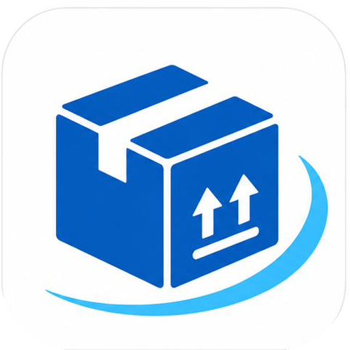

<div align="center">
  

  # Los Líderes Encomiendas

  **PWA multi-rol para gestión de encomiendas puerta a puerta**
  De Maicao (Colombia) a Maracaibo (Venezuela)

  
  
</div>

---

## 📦 ¿Qué es?

Los Líderes Encomiendas es una aplicación web progresiva (PWA) que digitaliza el
negocio de encomiendas de Los Líderes: los paquetes que compran los clientes en
tiendas online llegan a una bodega en Maicao, se registran con foto y medidas, se
les asigna un precio, y se entregan a domicilio en Maracaibo.

Una sola aplicación, una sola URL, con **tres interfaces según el rol** del usuario.

---

## 👥 Roles

| Rol | Qué hace |
|-----|----------|
| **Cliente** | Ve su código de casillero, la dirección de la bodega, el estado y precio de sus paquetes. |
| **Bodeguero** | Registra paquetes que llegan a Maicao con foto, medidas y peso, asignándolos a un casillero. |
| **Administración** | Tarifa los paquetes, asigna conductor y monto de traslado, gestiona usuarios, tarifas, contabilidad y auditoría. |

Un mismo usuario puede tener varios roles.

---

## 🎨 Paleta de marca

| Color | Hex | Uso |
|-------|-----|-----|
| Blanco | `#FFFFFF` | Fondos, tarjetas |
| Azul cielo | `#4FC3F7` | Acentos, detalles |
| Azul medio | `#1565C0` | Botones, acciones principales |
| Azul marino | `#0D2B5E` | Headers, texto destacado |

---

## 🛠️ Stack tecnológico

- **Frontend:** React 18 + Vite + Tailwind CSS 4
- **Estado:** Zustand (auth) + TanStack Query (datos)
- **Formularios:** React Hook Form + Zod
- **Backend (BaaS):** Supabase (PostgreSQL + Auth + Storage + RLS)
- **Autenticación:** Email/contraseña + Google OAuth
- **Hosting:** Railway
- **Iconos:** Lucide React

---

## 🚀 Desarrollo local

### Requisitos
- Node.js 20 LTS o superior
- Cuenta de Supabase

### Instalación

```bash
# Clonar el repo
git clone https://github.com/loslideres-dev/loslideres-app.git
cd loslideres-app/frontend

# Instalar dependencias
npm install

# Configurar variables de entorno
cp .env.example .env
# Edita .env con tus credenciales de Supabase

# Arrancar en modo desarrollo
npm run dev
```

La app estará en `http://localhost:5173`.
Para acceder desde el celular en la misma red, usa la URL `Network` que muestra Vite.

---

## 🔑 Variables de entorno

Crea un archivo `.env` en `/frontend`:

```env
VITE_SUPABASE_URL=https://tuproyecto.supabase.co
VITE_SUPABASE_ANON_KEY=tu_anon_key
VITE_APP_VERSION=0.2.0
VITE_APP_NAME=Los Líderes Encomiendas
```

⚠️ Nunca subas el archivo `.env` al repositorio.

---

## 📂 Estructura del proyecto

```
frontend/
├── src/
│   ├── assets/            # Logo y recursos estáticos
│   ├── components/
│   │   ├── layout/        # Layouts por rol (Cliente, Bodeguero, Admin)
│   │   └── ui/            # Componentes reutilizables (Modal, Toast, etc.)
│   ├── constants/         # Roles, estados, colores, datos de bodega
│   ├── hooks/             # Hooks de datos (paquetes, tarifas, perfiles, auditoría)
│   ├── lib/               # Cliente Supabase, utilidades de imagen
│   ├── pages/
│   │   ├── auth/          # Login, registro, onboarding, recuperación
│   │   ├── cliente/       # Casillero, paquetes, detalle, perfil
│   │   ├── bodeguero/     # Recepción, registros del día
│   │   └── admin/         # Dashboard, paquetes, tarifas, usuarios, auditoría
│   ├── store/             # Estado global (auth)
│   ├── App.jsx            # Rutas y guards por rol
│   └── main.jsx           # Entry point
├── supabase_migrations.sql
├── .versionrc.json        # Config del changelog
└── vite.config.js
```

---

## 📋 Estados de un paquete

```
RECIBIDO → TARIFADO → EN_TRANSITO → EN_REPARTO → ENTREGADO
```

1. **RECIBIDO** — el bodeguero lo registra en Maicao
2. **TARIFADO** — administración le asigna precio
3. **EN_TRANSITO** — despachado hacia Maracaibo
4. **EN_REPARTO** — el conductor lo lleva al domicilio
5. **ENTREGADO** — entregado y pagado

---

## 🔒 Seguridad

- Autenticación con JWT vía Supabase Auth
- Row Level Security (RLS) en todas las tablas
- Cada cliente solo ve sus propios paquetes
- Las acciones quedan registradas en el módulo de auditoría (append-only)
- Fotos comprimidas a máx. 300 KB antes de subir

---

## 📦 Versionado

Este proyecto usa [Conventional Commits](https://www.conventionalcommits.org/)
y [standard-version](https://github.com/conventional-changelog/standard-version)
para el control automático de versiones y changelog.

```bash
npm run release          # patch/minor automático según commits
npm run release:minor    # forzar minor
npm run release:major    # forzar major
```

Tipos de commit: `feat`, `fix`, `perf`, `refactor`, `chore`, `docs`, `style`, `test`.

---

## 📄 Licencia

Software privado — Los Líderes Encomiendas © 2026. Todos los derechos reservados.
